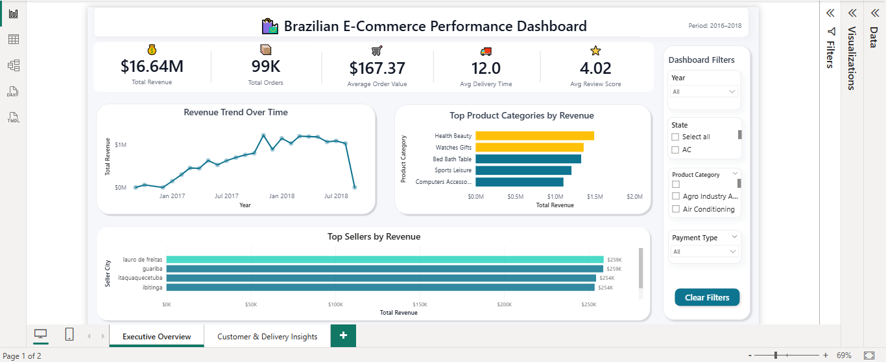
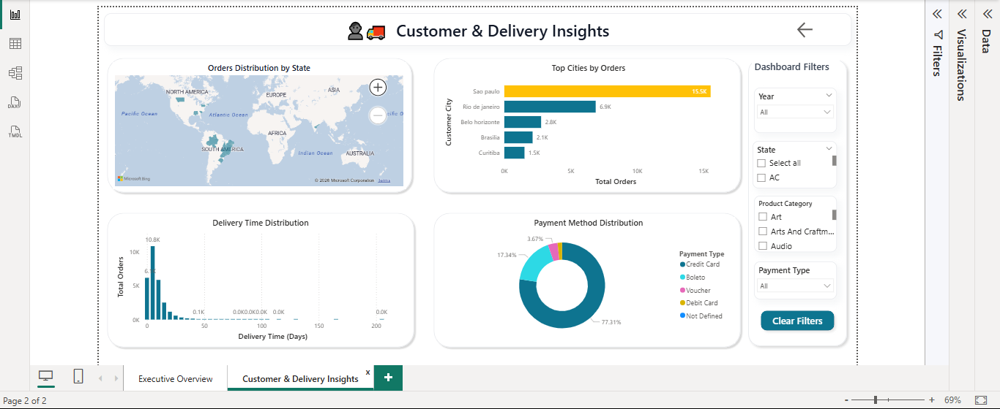

# Brazilian E-Commerce Sales Analysis (Python + Power BI)

## Overview

This project explores sales performance from the Brazilian Olist e-commerce marketplace.
The goal was to analyze order trends, product demand, seller performance, delivery efficiency, and customer payment behavior using Python and Power BI.

The analysis is based on the public **Olist Brazilian E-Commerce dataset**, which contains order, customer, product, and review information from 2016 to 2018.

Using Python, the data was cleaned and explored to understand patterns in sales and logistics performance. The processed dataset was then used to build an interactive **Power BI dashboard** that summarizes the most important business insights.

---

## Dataset

Source: Olist Brazilian E-Commerce Dataset
https://www.kaggle.com/datasets/olistbr/brazilian-ecommerce

The dataset includes information such as:

* Orders
* Customers
* Products
* Sellers
* Payments
* Reviews
* Delivery timestamps

After merging and cleaning the data, the final dataset used for analysis contained **over 99,000 orders across multiple product categories and Brazilian states.**

---

## Tools Used

Python
Pandas
NumPy
Matplotlib
Seaborn
Jupyter Notebook
Power BI

---

## Project Workflow

### 1. Data Cleaning

The raw tables were merged to create a master dataset containing order, product, payment, and customer information.

Key transformations included:

* Converting timestamp columns to datetime format
* Creating delivery time and delivery delay features
* Handling missing values in review and delivery columns
* Removing unnecessary columns
* Standardizing product category names to English

---

### 2. Exploratory Data Analysis (Python)

Exploratory analysis was performed to understand order patterns, delivery performance, and customer behavior.

Some of the questions explored:

* How has revenue changed over time?
* Which product categories generate the most revenue?
* Which sellers contribute the most sales?
* How long do deliveries usually take?
* What payment methods do customers prefer?

---

### 3. Power BI Dashboard

An interactive Power BI dashboard was created to summarize the main insights from the dataset.

The dashboard contains two pages:

### Executive Overview

Key business metrics:

* **Total Revenue:** $16.64M
* **Total Orders:** 99K
* **Average Order Value:** $167.37
* **Average Delivery Time:** 12 days
* **Average Review Score:** 4.02 / 5

Main visualizations include:

* Monthly revenue trend
* Top product categories by revenue
* Top sellers by revenue

---

### Customer & Delivery Insights

This page focuses on operational and customer behavior insights.

Visualizations include:

* Orders distribution by state
* Top cities generating orders
* Delivery time distribution
* Payment method distribution

Some notable observations:

* **São Paulo generates the highest number of orders (~15.5K)** among all cities.
* **Credit cards account for the majority of transactions (~77%)**, indicating strong adoption of digital payments.
* Most orders are delivered within **10–15 days**, with an overall **average delivery time of about 12 days**.

---

## Dashboard Preview

### Executive Overview



### Customer & Delivery Insights



---

## Repository Structure

```
brazilian-ecommerce-sales-analysis
│
├── notebooks
│   └── olist_data_analysis.ipynb
│
├── powerbi
│   └── brazilian_ecommerce_dashboard.pbix
│
├── images
│   ├── dashboard_page1.png
│   └── dashboard_page2.png
│
├── requirements.txt
└── README.md
```

---

## Author

Ashutosh Jamnal

LinkedIn
https://www.linkedin.com/in/ashutosh-jamnal

GitHub
https://github.com/ashujamnal
